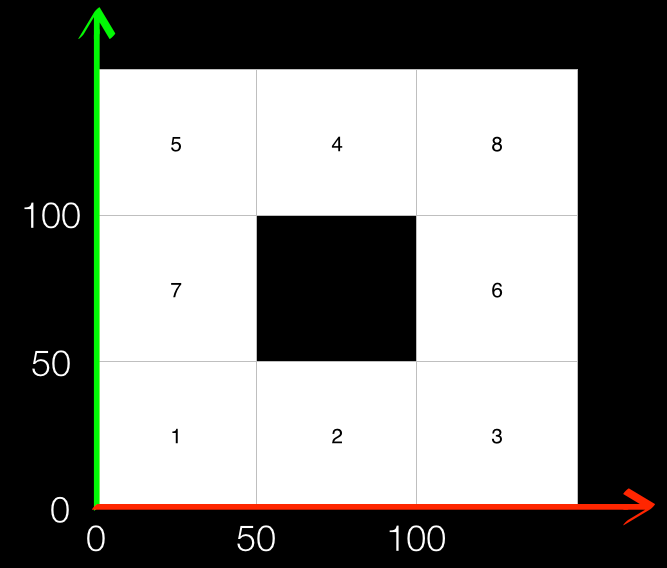
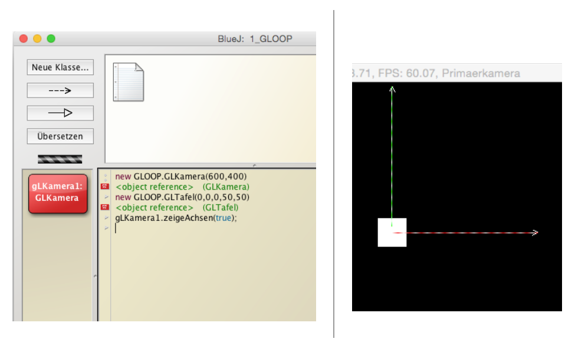
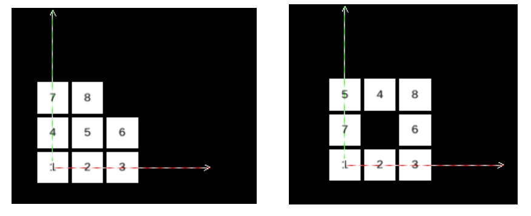
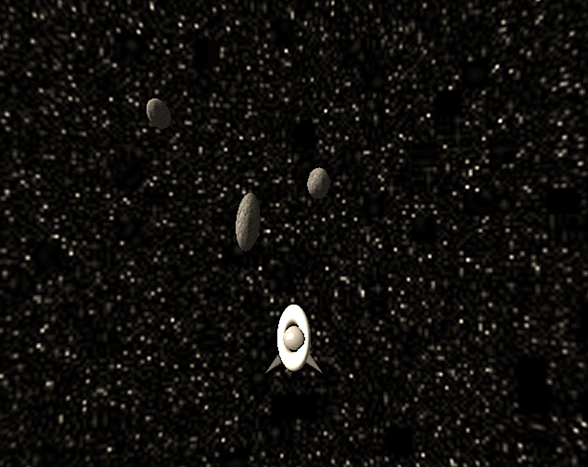

<!--
This template is written for the `atom-elearnjs` package. You do not need
anything else but the files linked in here to convert this .md to HTML or PDF.
-->

<!--meta
    Title: elearn.js Template
    Author: Name Autor
    Description: Hier Beschreibung einfügen
    Keywords: Key, Words
    Custom: "<script>
                window.onload = function() {
                    eLearnJS.setNavigationTitle('Template Überschrift');
                }
            </script>
            <script type=\"text/x-mathjax-config\">
                MathJax.Hub.Config({
                    extensions: [\"tex2jax.js\"],
                    jax: [\"input/TeX\", \"output/HTML-CSS\"],
                    tex2jax: {
                        inlineMath: [ ['$','$'], [\"\\(\",\"\\)\"] ],
                        displayMath: [ ['$$','$$'], [\"\\[\",\"\\]\"] ],
                        processEscapes: true
                    },
                    \"HTML-CSS\": { availableFonts: [\"TeX\"] }
                });
            </script>
            <script type=\"text/javascript\" src=\"https://cdnjs.cloudflare.com/ajax/libs/mathjax/2.7.1/MathJax.js\"></script>"
-->

<!--imprint
    #### elearn.js Template
    Universität Hamburg

    <small>
        Das <span xmlns:dct="http://purl.org/dc/terms/" property="dct:title">elearn.js Template</span>
        von <span xmlns:cc="http://creativecommons.org/ns#" property="cc:attributionName">Universität Hamburg</span>
        ist lizenziert unter einer <a rel="license" href="http://creativecommons.org/licenses/by-sa/4.0/">
        Creative Commons Namensnennung</a> - Weitergabe unter gleichen Bedingungen 4.0 International Lizenz
    </small>
-->


# 1. Grundlagen

In diesem Kapitel werden kurz die in diesem Lehrbuch verwendeten Werkzeuge vorgestellt. Dazu zählt der Java-Editor BlueJ und die GLOOP-Klassen-Bibliothek, mit Hilfe deren Sie schnell und kreativ auch eigene Ideen umzusetzen lernen werden.

|||Name der Seite///

# 1.1 BlueJ und GLOOP
Für die Arbeit mit diesem Lehrbuch benötigt man die Java-Bibliothek GLOOP und einen Java-Editor. Im folgenden wurde BlueJ eingesetzt. Eine Installationsanleitung ist [hier](http://www.schulentwicklung.nrw.de/cms/programmierung-mit-gloop/installation/index.html "Installationsanleitung") verlinkt.

|||Name der Seite///

# 1.2 Zeichen und Texturen
Um die Objekte mit Texturen oder Schriftzeichen zu überziehen, ist darauf zu achten, dass die Datei `Zeichen.png` bzw.die gewünschten Texturen im Projektordner abgelegt sind. Sollte das Projekt noch nicht gespeichert worden sein,muss man über `Datei -> Speichern unter` einen Projektordner anlegen. Über den Dateimanager kann dann die notwendige Bilddatei (.png oder .jpg) in den Ordner abgelegt werden.

|||Name der Seite///

# 2. Schiebepuzzle I

In diesem Kapitel erstellen wir mit GLOOP ein Schiebepuzzle. Schiebepuzzle sind gibt es schon sehr lange und in verschiedenen Ausführungen, meist mit 8 oder 15 Puzzleteilen.

Bei Schiebepuzzlen ist es das Ziel alle Puzzleteile in eine vorgegebene Reihenfolge zu bringen, wobei die Puzzleteile nur auf ein freies benachbarte Feld verschoben werden können. Weitere Informationen zu Schiebepuzzlen findet man in der [Wikipedia](https://de.wikipedia.org/wiki/15-Puzzle "Schiebepuzzle").

|||Name der Seite///

# 2.1 Programme per Hand ausführen
Du hast gelernt Klassendiagramme zu erstellen. Nun wirst Du lernen Programmanweisungen aufzuschreiben, mit denen Du später Dein erstes echtes Computer-Programm steuern kannst. Unten siehst Du ein Koordinatensystem abgebildet, in dem sich 8 Puzzleteile befinden. Diese Teile lassen sich durch Verschieben in die richtige Reihenfolge bringen (von unten links nach oben rechts aufsteigend) . Dabei lässt sich ein Puzzle-Teil nur in ein leeres Puzzlefeld schieben, wie bei einem echten Schiebepuzzle.
Da es in unserer verwendeten Programmierwelt 3 Dimensionen gibt musst Du auch hier immer 3 Koordinaten zum Verschieben eines Puzzleteils angeben. Die rote (waagerechte) Achse ist die x-Achse, die grüne (senkrechte) Achse ist die y-Achse. Später gibt es dann noch die blaue Achse als z-Achse. (x- und z-Achse liegen dabei, wie bei allen aktuellen Spiele-Engines, in der Bodenebene.)



**Beispiele**:
- zum Verschieben des zweiten Puzzleteils nach oben:

 `dasTeil2.verschiebe(0,50,0)`
- zum Verschieben des siebten Puzzleteils nach rechts:
 `dasTeil7.verschiebe(50,0,0)`

- allgemein:
`dasTeil#.verschiebe(x,y,z)`

**1. Aufgabe**:  Notiere die Programmanweisungen, die notwendig sind, um das oben abgebildete Schiebepuzzle zu lösen. Schneide dazu die Puzzleteile auf dem zweiten Arbeitsblatt aus und zeichne ein Koordinatensystem auf ein leeres Blatt.
assert(true);



Kontrolliere Deinen Lösungsweg, indem Du auf `Solution` klickst:


Hier darf derzeit leider kein Programmcode eingegeben werden!
Ansonsten kann die Lösung nicht angezeigt werden!

dasTeil4.verschiebe(0,-50,0);
dasTeil5.verschiebe(50,0,0);
dasTeil7.verschiebe(0,50,0);
dasTeil4.verschiebe(-50,0,0);
dasTeil5.verschiebe(0,-50,0);
dasTeil8.verschiebe(-50,0,0);







 **2. Aufgabe**:  Führe zunächst maximal 5 Anweisungen auf das gelöste Puzzle durch und notiere Dir die Anweisungen. Dein Partner versucht das so verschobene Puzzle zu lösen und notiert seine Anweisungen. Vergleicht eure notierten Anweisungen. Was stellt ihr fest?

 **3. Aufgabe**:  Entwickle anhand des echten Schiebepuzzles oder des Papier-Schiebepuzzles eine allgemeine Lösungsstrategie für Schiebepuzzle und notiere diese.

 **4. Aufgabe**:  Gibt es eine Möglichkeit das Schiebepuzzle so zu legen, dass es nicht lösbar ist? Stelle eine Vermutung an, probiere es aus und recherchiere dazu im Internet.

|||Name der Seite///

# 2.2 Direkteingabe

Das Schiebepuzzle, dass eben noch auf Papier ausgedruckt gespielt wurde,soll nun mit dem Code-Editor BlueJ programmiert und gesteuert werden. Dieser Editor bietet eine _Direkteingabe_ an \(-&gt; Ansicht oder Strg + E\). Dort kann zunächst mit dem Befehlsaufruf

```java
new GLOOP.GLKamera(600,400)
```

eine Kamera erzeugt werden,die einen Blick in die _GLOOP-Welt_ erlaubt. Um ein bißchen mehr Orientierung zu bekommen ist es hilfreich, mit der GLKamera-Methode `zeigeAchsen(true)`die x- und y-Koordinatenachsen anzeigen zu lassen. Um Die Kamera ansprechen zu können,muss diese zunächst einen Namen \(_Referenzierung_\) bekommen. Dazu muss das kleine rote Icon in das Feld links neben die Direkteingabe gezogen werden, wie es bereits in der unten stehenden Abbildungen bereits vollzogen worden ist.



## Aufgabe

Programmieren Sie nun, wie in den Screenshots zu sehen, das Schiebepuzzle zu Ende. Um die Tafeln auch beschriften zu können, muss darauf geachtet werden, dass die Datei `Zeichen.png` im Projektordner abgespeichert wurde. Mit der `verschiebe`-Methode aus dem Kapitel [Unplugged](/das-schiebepuzzle-teil1/unplugged.md) können die Objekte vomTyp `GLTafel` auch verschoben werden.





|||Name der Seite///

# 3. GLOOP-Welten

Während wir bisher nur in zwei Dimensionen Objekte in der GLOOP-Welt manipuliert haben, sollen nun Objekte auch in drei Dimensionen positioniert und verschoben werden.

|||Name der Seite///

# 3.1 Skulpturengarten

Nachdem Sie nun bereits ein erstes Schiebpuzzle kreiert haben, sollen Ihre Fähigkeiten bei der Programmierung eines Skulpturengartens trainiert werden.

## Aufgabenstellung
Erstellen Sie einen Skulpturengarten, in dem Sie beliebige Arten von Skulpturen designen und kreisförmig um einen Mittelpunkt anordnen. Verwenden Sie als Grundlage,den Code aus [Hallo! Leere Welt!](##Hallo! Leere Welt!).  


##Hallo! Leere Welt!

```java
import GLOOP.*;
class HalloWelt{
//Kamera und Umgebung deklarieren
GLKamera kamera;
GLLicht licht;
GLBoden boden;
GLHimmel himmel;


HalloWelt(){
//Kamera und Umgebung instanziieren
kamera = new GLSchwenkkamera();
kamera.setzePosition(0,300,500);
licht = new GLLicht();
boden = new GLBoden("Gras.jpg");
himmel = new GLHimmel("Himmel.jpg");
}
}
```

**Tipp**
Verwende für die kreisförmige Anordnung der Objekte [Methoden aus der Grundlagenübersicht](../klassen-und-methodenubersicht-von-gloop.md#GLOOP-Objekte).


|||Name der Seite///

# 3.2 Landeplatz

Nachdem im Skulpturengarten Objekte rein statisch waren, d.h. ohne sich selbst zu verändern oder die Position im Raum zu wechseln, sollen in diesem Projekt drei weitere Programmiertechniken verwendet werden:

1. Java-Arrays \(Felder\)
2. `for`-Schleifen
3. Animationen in GLOOP

Der folgende Programm-Code dient Ihnen als Prototyp zur Erstellung eines Hubschrauber-Landeplatzes.

**Aufgaben**  
1. Recherchieren Sie im Internet was eine Java-Array ist \(siehe z.B. [https://lezius.gitbooks.io/javakompakt/content/01-grundlagen/05-felder.html](https://lezius.gitbooks.io/javakompakt/content/01-grundlagen/05-felder.html "JAVAkompakt - Felder") \).  
2. Recherchieren Sie, wie eine for-Schleife funktioniert und erläutern Sie den Einsatz der for-Schleife im vorliegenden Prototypen.  \(siehe z.B: [Schleifen](/schleifen.md)\)  
3. Die Lichter sollen nun animiert werden. Sie sind entweder aus oder sie leuchten. Programmieren Sie folgende Animationen:

* Die Lichter gehen der Reihe nach an und aus. \(Variante 1\)
* Alle Lichter blinken gleichzeitig. \(Variante 2\)
* Überlegen Sie sich zusätzlich noch eine eigene Animation der Landeplatzlichter. \(Variante 3\)

**Tipps:** Um Lampen an- und auszuschalten, können Sie die GLOOP-Methode `setzeFarbe(double, double, double)` verwenden. Um einen Zeitpuffer von 1000 Millisekunden zwischen dem ein- und ausschalten der Lampen zu setzen verwenden Sie einfach den Befehl `Sys.warte(1000)`

```java
import GLOOP.*;
class Landeplatzszene{
    GLKamera kamera;
    GLLicht licht;
    GLHimmel himmel;
    GLBoden boden;
    GLTastatur tastatur;

    GLZylinder landeplatz;
    GLKugel[] lampe;

    Landeplatzszene(){
        kamera  = new GLSchwenkkamera();
        licht   = new GLLicht();
        himmel  = new GLHimmel("Himmel.jpg");
        boden   = new GLBoden("Gras.jpg");
        tastatur = new GLTastatur();

        //Landeplatz erstellen
        landeplatz = new GLZylinder(0,0,0,300,20);
        landeplatz.drehe(90,0,0);
        landeplatz.setzeTextur("Feld.jpg");

        //Lampen erstellen
        lampe = new GLKugel[20];
        for (int i=0; i<20; i++){
            lampe[i] = new GLKugel(290,20,0,10);
            lampe[i].drehe(_double_, _double_, _double_, _double_, _double_, _double_);
        }
    }

    void starteLauflichter(){

    }

    void starteBlinken(){

    }

}
```


|||Name der Seite///

# 3.3 Hindernisparcours
Mit dem verlinkten Prototypen kann ein Objekt über einer Kachelfeld bewegt werden. Verwende dazu folgende Methoden:


**Aufgaben**
1. Überlegen Sie einen Kontext, für ihren Hindernisparcours. Dies könnte ein Staubsaugerroboter in einem Zimmer, ein Hund im Park oder ein Rover auf einer Marsoberfläche sein.
2. Suchen Sie für den von Ihnen gewählten Kontext passende Texturen aus und gestalten Sie die Kachellandschaft passend.
3. Gestalten Sie einen Hindernisparcours den das gewählte Objekt durchlaufen/durchfahren soll.

|||Name der Seite///

# 3.4 Ballspiele

|||Name der Seite///

# 3.5 Das Schiebepuzzle II

Im [Kapitel 3](/das-schiebepuzzle-teil1.md) haben Sie sich mit einem Schiebepuzzle beschäftigt. Bei diesem Schiebepuzzel konnte man Puzzelteile auf Wegen verschieben, die eigentlich dem Spielprinzip nach eigentlich nicht erlaubt sind.

Im zweiten Teil soll nun ein Schiebepuzzel entwickelt werden, bei dem Puzzelteile nicht über den Rahmen oder über andere Puzzelteile hinweg verschoben werden können.

**Aufgaben**  
1. Analysieren Sie dazu zunächst den folgenden Programmcode. Erläutern Sie die Funktionsweise des Codes und gehen Sie dabei auch auf die Verwendung von [American Standard Code for Information Interchange ](https://de.wikipedia.org/wiki/American_Standard_Code_for_Information_Interchange)ein.  
2. Entwickeln Sie in Gruppenarbeit ein Prinzip, mit dem sich prüfen ließe, ob ein Puzzleteil verschoben werden dürfte, also ob das Feld auf das geschoben werden soll frei ist.  
3. Implementieren Sie die notwendige Methode `frei()` in Partnerarbeit.  
4. Gestalten sie das Schiebepuzzle nach Ihrem Geschmack neu.

```java
import GLOOP.*;

public class Puzzleanwendung
{
    private GLKamera dieKamera;
    private GLLicht dasLicht;
    private GLTastatur dieTastatur;
    private GLHimmel derHimmel;
    private GLBoden derBoden;
    private String richtung;
    private Puzzleteil[] dasTeil;
    private GLTafel anzeigeTafel;

    public Puzzleanwendung()
    {
        dieKamera = new GLSchwenkkamera(800,600);
        dieKamera.setzePosition(55,250,250);
        dieKamera.setzeBlickpunkt(55,0,0);
        dasLicht = new GLLicht();
        dieTastatur = new GLTastatur();
        derBoden = new GLBoden("Gras.jpg");
        derHimmel = new GLHimmel("Himmel.jpg");
        anzeigeTafel = new GLTafel(55,15,-100,  200,40 );
        anzeigeTafel.setzeText("Löse das Puzzle!!!",20);
        dasTeil = new Puzzleteil[8];
        int n=1;

        for(int j=0;j<3;j++){
            for(int i=0;i<3;i++){
                dasTeil[n-1]= new Puzzleteil(i,j,n);
                n++;
                if (n==9) break;
            }
        }
        fuehreAus();
        Sys.beenden();
    }

    void fuehreAus(){
        int markiert = 56;

        while (!dieTastatur.esc()){
            if (dieTastatur.wurdeGedrueckt()){
/** da das Zeichen nach dem Methodenaufruf gibZeichen() aus dem Speicher gelöscht
* wird, muss das Zeichen zunächst in einen Puffer geschrieben werden. Dann kann
* geprüft werden, ob die Tastatureingabe zulässig war. Wird etwas anderes als 1 bis 8
* eingegeben und die folgende IF-Abfrage wird nicht durchgeführt, kann es passieren
* , dass man einen Array-Fehler bekommt: java.lang.ArrayIndexOutOfBoundsException (Laufzeitfehler)
*/
                int puffer = dieTastatur.gibZeichen();
                if(48<puffer&&puffer<57){
                    markiert = puffer;
                }
            }

            if (dieTastatur.unten()){
                richtung ="unten";
                dasTeil[markiert-49].verschiebe(0,0,1);
                Sys.warte(10);
                if(!frei(markiert-49))
                {
                    dasTeil[markiert-49].verschiebe(0,0,-1);
                }
                else
                {
                    for(int i=1;i<55;i++){
                        dasTeil[markiert-49].verschiebe(0,0,1);
                        Sys.warte(10);
                    }
                }
            }
            if (dieTastatur.oben()){
                richtung = "oben";
                dasTeil[markiert-49].verschiebe(0,0,-1);
                Sys.warte(10);
                if(!frei(markiert-49))
                {
                    dasTeil[markiert-49].verschiebe(0,0,1);
                }
                else
                {
                    for(int i=1;i<55;i++){
                        dasTeil[markiert-49].verschiebe(0,0,-1);
                        Sys.warte(10);
                    }
                }
            }

            if (dieTastatur.rechts()){
                richtung = "rechts";
                dasTeil[markiert-49].verschiebe(1,0,0);
                Sys.warte(10);
                if(!frei(markiert-49)){dasTeil[markiert-49].verschiebe(-1,0,0);
                }
                else
                {
                    for(int i=1;i<55;i++){
                        dasTeil[markiert-49].verschiebe(1,0,0);
                        Sys.warte(10);
                    }
                }
            }

            if (dieTastatur.links()){
                richtung = "links";
                dasTeil[markiert-49].verschiebe(-1,0,0);
                Sys.warte(10);
                if(!frei(markiert-49))
                {
                    dasTeil[markiert-49].verschiebe(1,0,0);
                }
                else
                {
                    for(int i=1;i<55;i++){
                        dasTeil[markiert-49].verschiebe(-1,0,0);
                        Sys.warte(10);
                    }
                }
            }

            Sys.warte();

        }         
        Sys.beenden();

    }

    public boolean frei(int pN){
        return true;
    }
    }
}
```


```java
import GLOOP.*;

public class Puzzleteil
{
    private GLTafel dieTafel;
     private int i;
     private int j;
     private int platz;

    public Puzzleteil(int pI, int pJ, int pN)
    {
        int i = pI;
        int j = pJ;
        this.setzePlatz(pN);
        dieTafel = new GLTafel(i*55,1,j*55,50,50);
        dieTafel.drehe(270,0,0);
        dieTafel.setzeText(""+platz,20);
    }

    public void verschiebe(int x, int y, int z)
    {
        dieTafel.verschiebe(x,y,z);
    }

    public float gibX()
    {
        return dieTafel.gibX();   
    }

    public float gibZ()
    {
        return dieTafel.gibZ();   
    }

    public void setzePlatz(int pPlatz)
    {
        this.platz = pPlatz;
    }

    public int gibPlatz()
    {
        return this.platz;
    }
}

```


|||Name der Seite///

# 3.6 Das UFO-Spiel


## Aufgaben

1. Analysiere den Programm-Code des Ufo-Spiels.
2. Erläutern Sie, wie die Kollisionsabfrage zwischen dem Ufo und einem Asteroiden realisiert wurde.
3. Entwerfen Sie ein Implementationsdiagramm zum Ufo-Spiel mit gerichteten Assoziationen.\([Hinweise](http://www.schulentwicklung.nrw.de/lehrplaene/upload/klp_SII/if/MaterialZABI/2016-08-30_Dokumentation_GK_ab_Abitur_2018.pdf "Vorgaben\_NRW\_GK\_Abitur\_ab\_2018")\)
4. Führen Sie für die Asteroiden ein Array ein.

|||Name der Seite///

# 4. MakeyMakey

Das MakeyMakey-Board ist dazu gedacht, Spiele, die man normalerweise mit einer Comutertastatur steuert, durch Berührung von leitenden Objekte zu steuern. Das eingebettete Video zeigt ein paar exemplarische Beispiele:


https://youtu.be/rfQqh7iCcOU


|||Name der Seite///

#4.1 Eigene Spielideen programmieren
**Aufgabe: Designe ein Spiel für den Tag der offenen Tür**
1. Plant das Spieledesign und die Spielregeln in 4er-Gruppen (Think/Pair/Share). Überlegt Euch dazu zunächst alleine Spielideen, die ihr gerne umsetzen würdet, fertig Skizzen an und stellt sie Euch gegenseitig in euren Gruppen vor.
2. Erstellt ein Plakat auf dem ihr euer Spieledesign präsentiert.

Beachtet bei euren Überlegungen folgende Kriterien:
* Bei dem Spiel muss die Tastatur verwendet werden, so dass ein Objekt verschoben wird.
* Das Spiel soll für zwei Mannschaften sein.
* Das Spiel muss zurückmelden, wer gewonnen hat.
---


https://www.youtube.com/watch?v=5XjZ2MFmYjk

