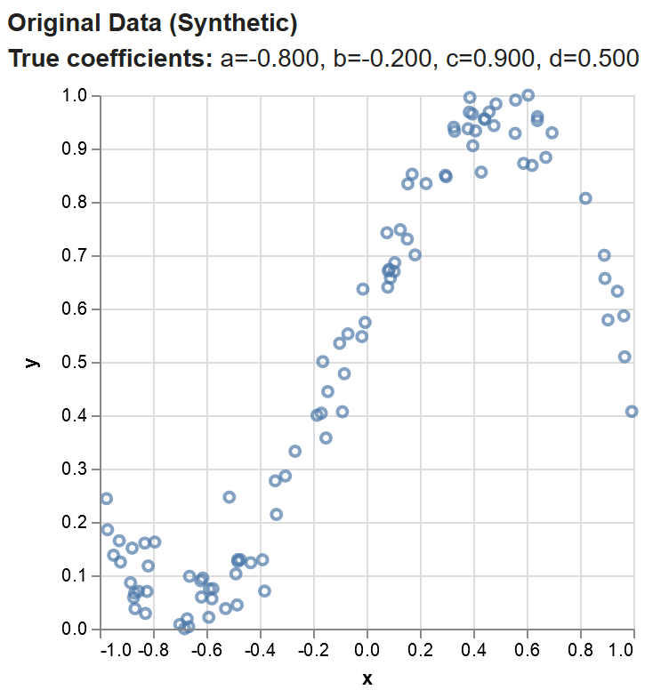
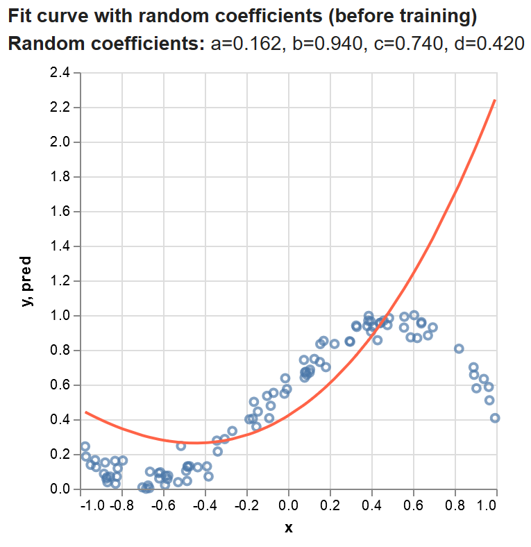
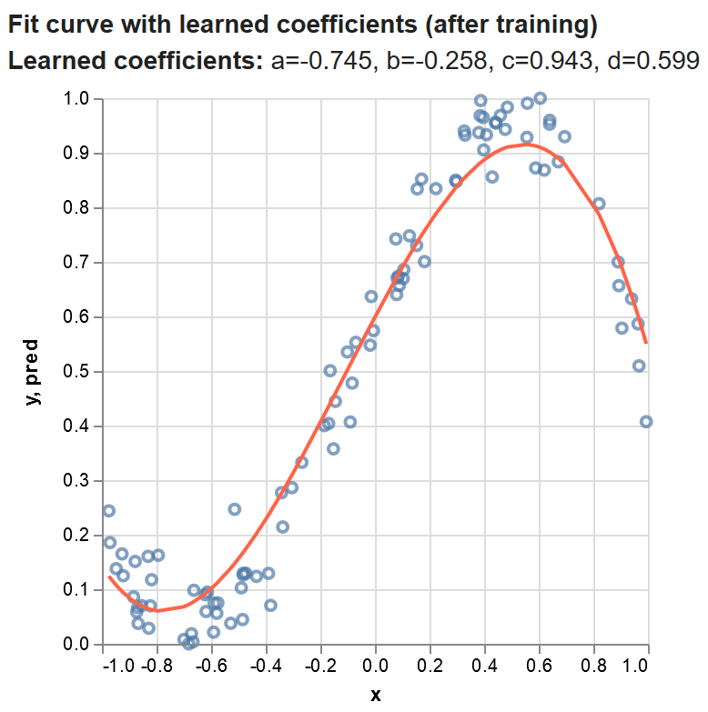

# Grundlagen ausprobiert

i> Die technische Umsetzung findet hier in JavaScript mit [TensorFlow.js](https://js.tensorflow.org) statt. Dies geschieht primär aus didaktischen Gründen. Um schnellere Ergebnisse zu erziehlen verwendet man etwa [TenserFlow](https://www.tensorflow.org/) mit Python. 

## Eine Funktion anhand gegebener Werte ermitteln

Das erste Beispiel ist ein sehr einfaches, welches ausschließlich dazu dient das Grundkonzept von TensorFlow.js zu verstehen.

Das fertige Beispiel findest du auf **[apps.wi-wissen.de](https://apps.wi-wissen.de/neuronale-netze/polynomial-regression-core/)**.  Sofern du [node.js](https://nodejs.org/de/) und [yarn](https://yarnpkg.com/en/) installiert hast, kannst du dir den Quelltext auch selbst herunterladen:

```bash
git clone https://github.com/tensorflow/tfjs-examples
cd tfjs-examples/polynomial-regression-core
yarn
yarn watch
```

Stell dir vor du machst ein Experiment in Physik, für das folgende Gesetzmäßigkeit gilt:

```
y = -8x^3 + -0.2x^2 + 0.9x + 0.5
```

Du hast bei deinem Experiment aber nur die folgenden Werte gemessen:



Da wir wissen, dass die Formel die Funktion der Form ` y = ax^3 + bx^2 + cx + d`  hat, legen wir vier Variabeln an und belegen diese mit zufälligen Werten:

```javascript
const a = tf.variable(tf.scalar(Math.random()));
const b = tf.variable(tf.scalar(Math.random()));
const c = tf.variable(tf.scalar(Math.random()));
const d = tf.variable(tf.scalar(Math.random()));
```

Unsere Zielfunktion dazu können wir mit entsprechenden Funktionen passend zur Formel beschreiben:

```javascript
function predict(x) {
  // y = a * x ^ 3 + b * x ^ 2 + c * x + d
  return tf.tidy(() => {
    return a.mul(x.pow(tf.scalar(3))) // a * x^3
      .add(b.mul(x.square())) // + b * x ^ 2
      .add(c.mul(x)) // + c * x
      .add(d); // + d
  });
}
```

i> `() => {...}` bedeutet, dass eine Funktion geschaffen wird, welche im selben Kontext (`this.`) arbeitet, wie die übergeordnete Funktion.

i> Wir übergeben hier also dem Attribut `tf.tidy()` eine Funktion als Parameter. Diese wird dann intern an passender Stelle ausgeführt.

Unser erster Testlauf führt dann auch schon zu einem Ergebnis:



Gut, also wir haben eine Funktion, aber da die Variabeln `a`,`b`,`c` und `d` geraten wurden, eine gänzlich andere Funktion.

Also erstellen wir im nächsten Schritt eine Kostenfunktion, damit wir uns den blauen Punkten annähern:

```javascript
function loss(predictions, labels) {
  const meanSquareError = predictions.sub(labels).square().mean();
  return meanSquareError;
}
```

Diese Kostenfunktion kennst du bereits aus den Grundlagen.

i> In dieser Funktion ziehen wird unsere aktuellen Werte `labels` von den blauen Punkten `prediction` ab und bilden davon das Quadrat. Letzteres sorgt dafür, dass es immer ein positiver Wert ist um den eine Abweichung besteht.

Jetzt bestimmen wir nach welcher Methode wir wie schnell die Varaibeln ändern wollen:

```javascript
const learningRate = 0.5;
const optimizer = tf.train.sgd(learningRate);
```

Das können wir verwenden, um mit dem Training zu beginnen:

```javascript
function train(xs, ys, numIterations = 75) {

  const learningRate = 0.5;
  const optimizer = tf.train.sgd(learningRate);

  for (let iter = 0; iter < numIterations; iter++) {
    optimizer.minimize(() => {
      const predsYs = predict(xs);
      return loss(predsYs, ys);
    });
  }
}
```

i> Hierin legen wir fest, dass wir 75-mal trainieren wollen. Mit `predict(xs)` führen wir mit den aktuellen Variabeln die Berechnung nach unserer Formel durch und mit `loss(predsYs, ys)` bestimmen wir die Abweichung und geben diese als Ergebnis zurück.

Und nach nur 75 Anläufen kann sich unser Ergebnis schon sehen lassen:



i> Sicher ist dir aufgefallen, dass es noch immer eine kleine Abweichung zum richtigen Ergebnis gibt.

## Handgeschriebene Zahlen erkennen

Das fertige Beispiel findest du auf **[apps.wi-wissen.de](https://apps.wi-wissen.de/neuronale-netze/mnist/)**.  Sofern du [node.js](https://nodejs.org/de/) und [yarn](https://yarnpkg.com/en/) installiert hast, kannst du dir den Quelltext auch selbst herunterladen:

```bash
git clone https://github.com/tensorflow/tfjs-examples
cd tfjs-examples/mnist
yarn
yarn watch
```

Wir möchten in diesem Beispiel den Rechner dazu bringen handgeschriebene Zahlen zu erkennen:


Wir unterteilen dazu unsere handgeschriebenen Zahlen in zwei Mengen:

* Trainingsmenge - hiermit werden wir trainieren.
* Testmengen - hiermit werden wir testen, wie gut unser Training war.

Dies ist ein sehr wichtiges Vorgehen, um das sogenannte overfitting zu vermeiden. Beim overfitting funktioniert das Modell sehr gut für die gelernten Bilder, aber sehr schlecht für neue Bilder.

### Neuronales Netz benutzen

Da wir diesmal die Funktion zum Erkennen der Zahlen nicht kennen, erstellen wir wie in den Grundlagen beschrieben ein Modell:

```javascript
model.add(tf.layers.conv2d({
  inputShape: [28, 28, 1],
  kernelSize: 5,
  filters: 8,
  strides: 1,
  activation: 'relu',
  kernelInitializer: 'VarianceScaling'
}));
```


Folgender Einstellungen haben wir hier vorgenommen:

* `inputShape` - Wir haben festgelegt, wie die Auflösung und die Bildtiefe (wieder schwarz/weiß) sein soll. 

* `kernelSize` - Hier legen wir den Filter auf ein 5 × 5 Pixel großes Quadrat fest
* `filters` - die Anzahl der Filter (bisher hatten wir der Einfachheit halber immer nur von   einem Filter gesprochen. Auch werden die Filter hier ähnlich wie die Variablen selbst erzeugt)
* `strides` - Wie weit wird der Filter verschoben (bisher hatten wir den Filter immer um ein Pixel verschoben)
* `activation` - Aktivierungsfunktion (hier wieder ReLu))
* `kernelInitializer` - Methode wie wir die Variablen des Filters zu Beginn belegen wollen

Auch hier werden wir wieder das Ausgangsbild verkleinern, um robuster zu werden (Max Pool). Folgender Befehl halbiert damit die Auflösung:

```javascript
model.add(tf.layers.maxPooling2d({
  poolSize: [2, 2],
  strides: [2, 2]
}));
```

Jetzt können wir das zweidimensionale Bild, wieder in eine Reihe schreiben (Flatten):

```javascript
model.add(tf.layers.flatten());
```

Abschließend legen wir das Endergebnis fest:

```javascript
model.add(tf.layers.dense({
  units: 10,
  kernelInitializer: 'VarianceScaling',
  activation: 'softmax'
}));
```


`units` - Größe der Ausgabemenge. Wir möchten hier 10 Neuronen. Dabei soll nur eins `1` und die anderen `0` werden, um anzuzeigen welche der Ziffern `0-9` die dargestellte ist. (In Grundlagen 3 da getreift, glatt und Linie)

`kernelInitializer` - Wie legen wir die Variabeln zu Beginn zufällig fest.

`activation` - Wie normieren wir die Ergebnisse

### Neuronales Netz trainieren

Legen wir zu Beginn fest wie stark Variabeln verändert werden sollen und wie wir beim Verändern genau vorgehen:

```javascript
const LEARNING_RATE = 0.15;
const optimizer = tf.train.sgd(LEARNING_RATE);
```

Und schon können wir uns Modell zusammenbauen:

```javascript
model.compile({
  optimizer: optimizer,
  loss: 'categoricalCrossentropy',
  metrics: ['accuracy'],
});
```

Da  unsere Trainingsmenge nur ein kleine Teilmenge aller möglichen Bilder ist, kann es sein, dass unser gefundenes Minimum in einer neuen Teilmenge (da wo das künstliche neuronale Netz dann wirklich arbeiten soll) eher ein Berg ist. Daher unterteilen wir unsere Teilmenge in mehrere Teilmengen und lassen das küsntliche neuronale Netzwerk lernen sich in möglichst vielen Teilmengen ein gutes Tal zu suchen. Das erhöht die Wahrscheinlichkeit in einer neuen Teilmenge ebenfalls ein gutes Tal anzusteuern. Ähnlich einem erfahrenen Wandnerer bei Nebel.

i> Wie genau dies eingestellt wird findest du in der offiziellen Dokumentation von [TensorFlow.js](https://js.tensorflow.org/tutorials/core-concepts.html) auf englisch ausführlich erklärt.


